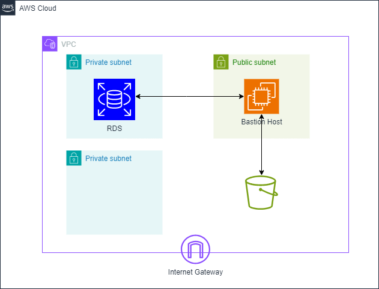

# Data Migration POC

This project is a big data migration to a new database system. This PoC aims to solve the next
requirements:
1. Move historic data from files in CSV format to the new database.
2. Create a Rest API service to receive new data. This service must have:
2.1. Each new transaction must fit the data dictionary rules.
2.2. Be able to insert batch transactions (1 up to 1000 rows) with one request.
2.3. Receive the data for each table in the same service.
2.4. Keep in mind the data rules for each table.
3. Create a feature to backup for each table and save it in the file system in AVRO format.
4. Create a feature to restore a certain table with its backup.


## Architecture


## Considerations
1. The infrastructure has already been deployed.
2. The datafiles are read from S3 and loaded to the MySQL RDS database.
3. The API is run locally in the EC2 instance.
4. The EC2 instance profile has the appropiate policies attached, including r/w to S3, reading from SSM Parameter Store, reading from Secrets Manager.


|File                         | Function                                                       |
|-----------------------------| -------------------------------------------------------------- |
|historical_data_load.py      | Create the tables and load historical data to the database     |
| create_backup.py            | Create a backup of the table and save it to S3 as an .avro file|
| restore_backup.py           | Restore a table from its .avro backup stored in S3             |
| main.py                     | Rest API in FastAPI to query / add data                        |

In order to use the API, clone the repository and run: ```uvicorn main:app --reload```